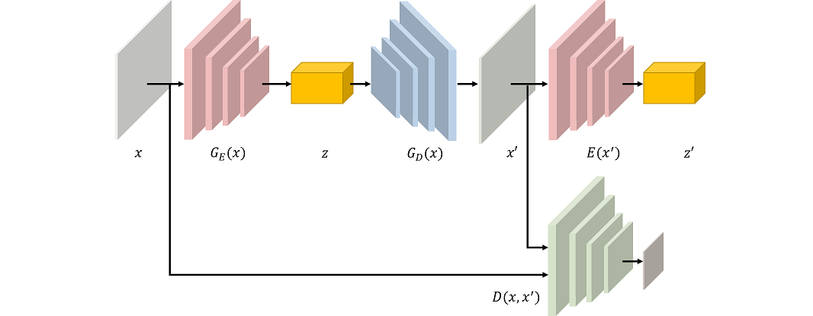
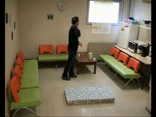

# Fall Detection in Videos Using Ganomaly
<!-- TOC -->

- [Fall Detection in Videos Using Ganomaly](#fall-detection-in-videos-using-lrcn)
    - [1. 项目概述](#1-项目概述)
    - [2. 数据预处理](#2-数据预处理)
    - [3. Ganomaly model overview](#3-lrcn-model-overview)
    - [4. 训练模型](#4-训练模型)
    - [5. 验证模型](#5-验证模型)

<!-- /TOC -->

### 1. 项目概述
&emsp;&emsp;我参考[论文](https://arxiv.org/abs/1805.06725)实现了搭建GANomaly模型，
并将模型在[Le2i Fall detection Dataset](http://le2i.cnrs.fr/Fall-detection-Dataset?lang=fr)
数据集上进行训练，所构建的Ganomaly模型可以对视频中发生的人的跌倒行为进行识别。对于跌倒检测这一时间序列数据结构，论文中的Enoder值相减，与阈值比较判断是否跌倒现阶段在准确率还有一定的问题，还需要进一步研究。

### 2. 数据预处理
&emsp;&emsp;使用的Le2i Fall detection Dataset视频数据中，只有部分视频具有跌倒动作，具体数据形式在[这里](https://www.yuque.com/nalaeur/bstyo8/pyacvh)，将原始数据存放在root_dir文件夹中，数据预处理阶段，将视频数据随机抽取clip_len帧数据，组成一个3D数据，处理后数据存储在output_dir文件夹中，这个过程只运行现一次。<br>
&emsp;&emsp;原始数据存储的格式为:<br>
```
root_dir
|_ Coffee_room_02
|  |_ [Videos]
|  |  |_ video (49).avi
|  |  |_ video (50).avi
|  |  |_ ...
|  |_ [Annotation_files]
|     |_ video (49).txt
|     |_ video (50).txt
|     |_ ...
```

### 3. LRCN 模型概述

- NetD自编码模块训练阶段只使用正常行为数据，所训练的模型能对原始图像数据具有有效的重构。<br>
- NETG网络的使用和对抗神经网络的思想，起到了一定的辅助作用。
- 现阶段还是比较在z_和z之间的差值与阈值的关系来判断是不是跌倒数据，后期还需要完善。


### 4. 训练模型
```
    python train.py  --root_dir /hdd01/lc/Le2i/Video \          # 原始视频数据
                            --save_dir /hdd01/lc/fall/save \           # 模型保存地址
                            --clip_len  4                              # 随机抽样图像数据个数
```

### 5. 验证模型
```
    python test.py  --checkpoint  /save/Gannormal_epoch-45.pth.tar \   # 保存的模型 
                                --input  /demo/input.mp4                     # 测试的文件
```





